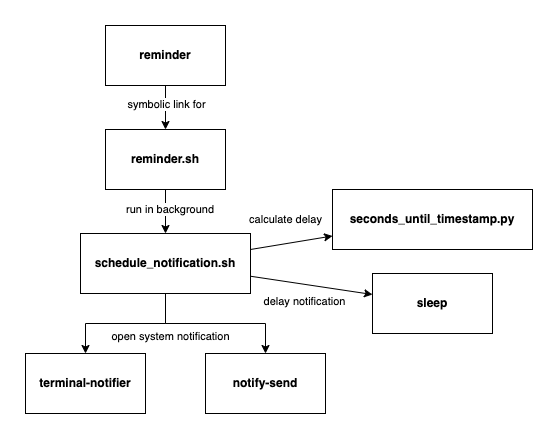

# Reminder

> allows to create scheduled system notifications from the terminal

## Overview

The `reminder` file is a symbolic link for the `reminder.sh` script. When a reminder is created, it runs the `schedule_notification.sh` script as background task. Inside `schedule_notification.sh` a Python script is called to determine the time offset until the requested notification. Then the `schedule_notification.sh` script sleeps for that time offset. Eventually it uses `terminal-notifier` to open the system notification on macOS or `notify-send` on Linux.



## Dependencies

### System

- Ubuntu or macOS
- Python3

### Debian / Ubuntu

The following additional dependency needs to be installed to open system notifications on Linux:

```
sudo apt-get install libnotify-bin
```

(see [libnotify](https://github.com/GNOME/libnotify) for details.)

### macOS

The following additional dependency needs to be installed to open system notifications on macOS:

```
brew install terminal-notifier
```

(See [terminal-notifier](https://github.com/julienXX/terminal-notifier) for details. Also see [apple.stackexchange.com](https://apple.stackexchange.com/questions/9412/how-to-get-a-notification-when-my-commands-are-done/85969#85969) for hints how to configure the alert style to remain open until it gets dismissed.)

### Installation

When the dependencies required for your system are installed, you can
install `reminder` by cloning the Git repository and putting its directory
on the binary path:

```
cd ~/src/experimental-software
git clone git@github.com:experimental-software/reminder.git
```

`vim ~/.bashrc` or `vim ~/.bash_profile`
```
PATH="~/src/experimental-software/reminder:$PATH"
```

## Usage

### Set a reminder in X minutes

```
reminder add 25
```

### Set a reminder with a message in X minutes

```
reminder add 25 "Take a break"
```

### Set a reminder with a link

```
reminder add 15 "Check test results" "https://jenkins/job/test"
```

### Set a reminder at a specific time

If a timestamp in `HOUR:MINUTE` format is provided, a reminder for the specific point in time will be created.
The `HOUR` needs to be an integer number in the range from 0-23 and the `MINUTE` needs the be an integer number in the range from 0-59.

```
reminder add 19:58 "Turn on radio"
```

### Show all scheduled reminders

```
reminder list
```

### Stop scheduled reminder

```
reminder stop <pid>
```
